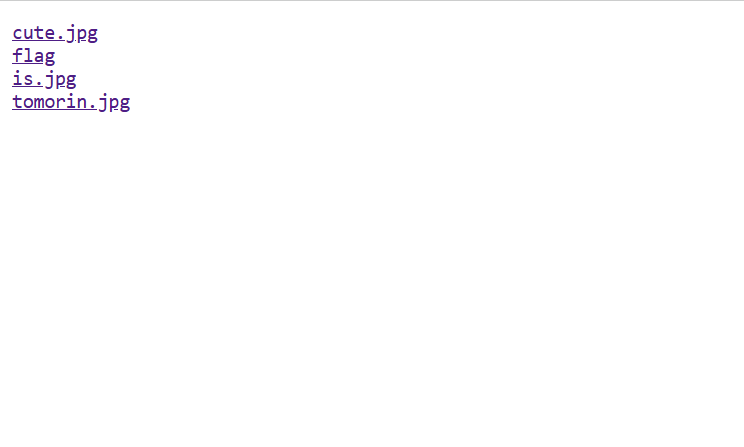
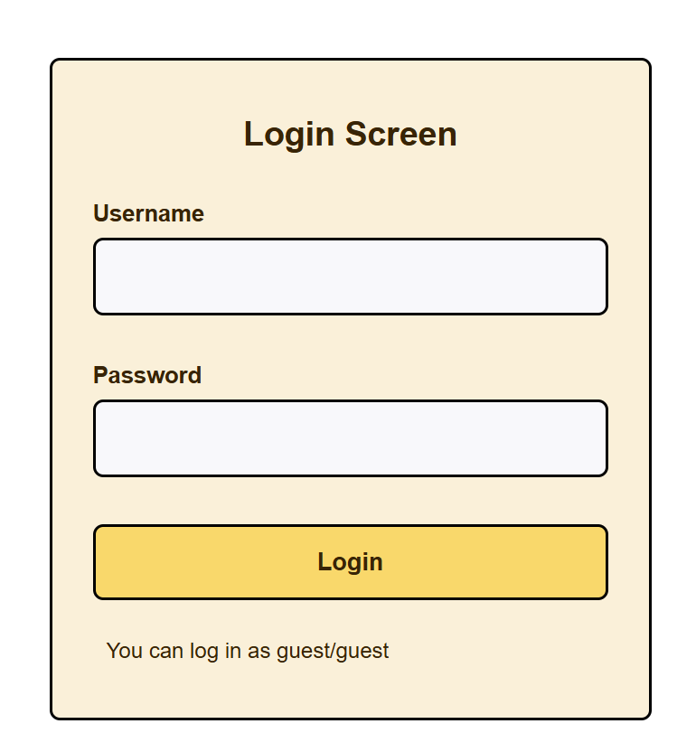
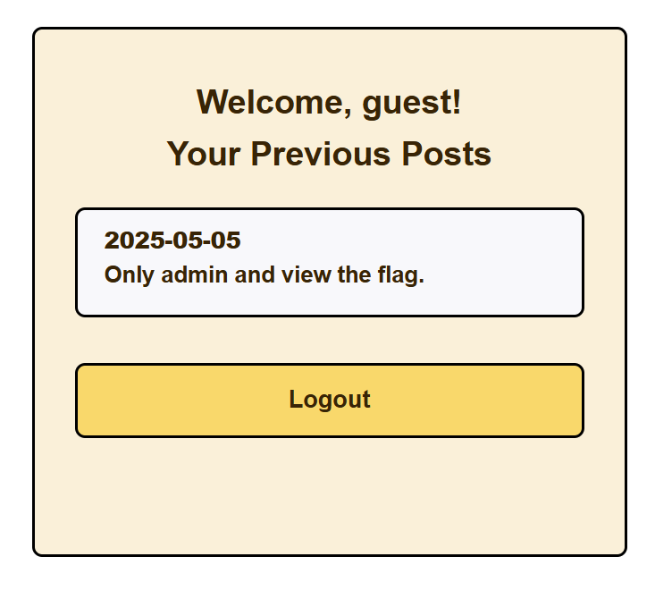
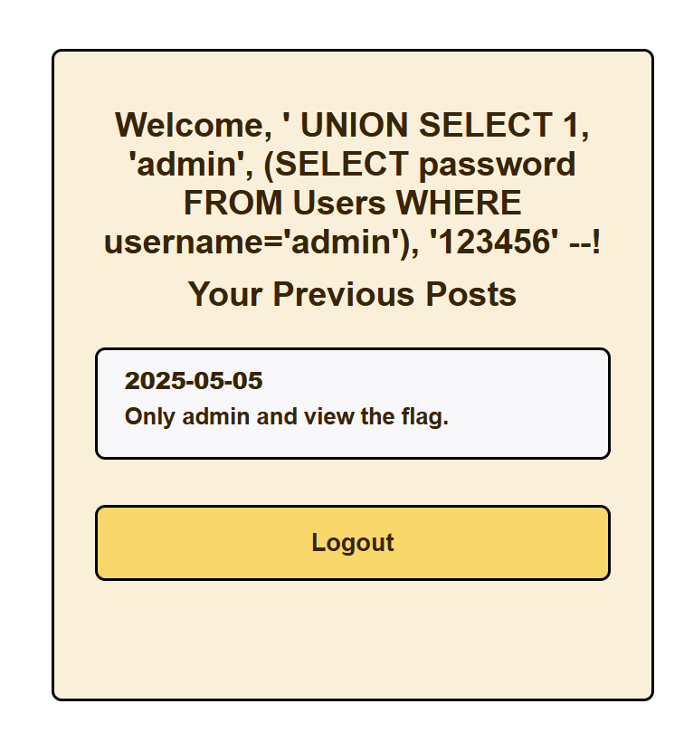

+++
date = '2025-05-28T16:24:48+08:00'
draft = true
title = 'AIS3 pre-exam write up'
+++


# 心得
這次pre-exam，

# Write up 


# 比賽後嘗試出來的題目 Write up 

## Welcome 
這題應該不用動甚麼腦子，但我還是被主辦方搞心態，附上的flag複製後進然是另外一個flag，所以就慢慢把flag打在答案框就過了

**Flag**：**AIS3{Welcome_And_Enjoy_The_CTF_!}**


## Ramen CTF

題目就是一張圖片，一張有猴子擋在拉麵前面，但是發現好像發票有一個qrcode，花了半小時再掃描qrcode，之後拿統一發票兌換APP去掃qrcode，就可以直接看到店家和吃那些餐點了，順便儲存發票

**Flag**：**AIS{}


## Tomorin db 🐧

這是剛進去題目會出現的東西，會發現有四個連結，每個點進去就進去個別的子頁面，但唯獨flag 點進去會被redirect到 youtube，因此可以打開題目附上的server code

``` go
package main

import "net/http"

func main() {
	http.Handle("/", http.FileServer(http.Dir("/app/Tomorin")))
	http.HandleFunc("/flag", func(w http.ResponseWriter, r *http.Request) {
		http.Redirect(w, r, "https://youtu.be/lQuWN0biOBU?si=SijTXQCn9V3j4Rl6", http.StatusFound)
  	})
  	http.ListenAndServe(":30000", nil)
}
```
可以發現只要是flag可以發現只要是flag 就會被redirect，一開始以為是path traversal的題目，以為可以到跟目錄之類的，但行不通，因此就開始往url encode的字元bypass這個機制，因此可以打"%2F"，這是編碼後的"/"

**URL**： **http://chals1.ais3.org:30000/%2Fflag**

**Flag**：**AIS3{G01ang_H2v3_a_c0O1_way!!!_Us3ing_C0NN3ct_M3Th07_L0l@T0m0r1n_1s_cute_D0_yo7_L0ve_t0MoRIN?}**


## Login Screen 1
這題也算是非常簡單的題目，但我搞了很久不知道為什麼


這是初始的網站介面，預設帳號密碼都填入guest就可以進入到2fa的子頁面，在2fa 輸入 "000000"，即可進入dasboard 


在dasboard 發現只有admin 能夠進入😭，logout 後輸入在帳號和密碼輸入admin，發現也可以進入2fa的子頁面，但是不知道2fa code是甚麼，於是我研究了一下Server端的db，嘗試透過sql injection，使用 "' UNION SELECT 1, 'admin', (SELECT password FROM Users WHERE username='admin'), '123456' --"，把admin的2fa code更改成123456，結果成功了。

但是竟然被parse出來了😭，我又去看了server code，發現最後要檢查username 是否等於 admin，因此我又花很多時間去找有注入sql injection 指令後最後又能夠被偵測是admin 的方法，結果沒有。
之後我發現我一直在看server端的code，忽視了docker-compose file的存在，於我去看了一夏docker-compose file裡面的東西，發現竟然可以下載user.db，下載之後就找到admin 2fa code(51756447753485459839)了😭，然後就拿到flag了

**Flag**：**AIS3{1.Es55y_SQL_1nJ3ct10n_w1th_2fa_IuABDADGeP0}**

**Flag**:


