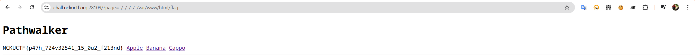

+++
date = '2025-04-25T09:42:57+08:00'
draft = true
title = 'Scist Writeup'
+++

## shiba shop

### 解法

一開始會出現一個購買gallery的畫面，會有不同商品價額也不同，唯獨flag的價格特別高買不起

隨便購買一個商品，在商品內可以改價格價格的input，在cost 那一個部份的value改為-99999999999999999，這樣就等於把你錢加上99999999999999999

發現你的錢變超多，之後你就可以買flag了，但是flag的按鈕按不下去，所以可以觀察進入每個商品時連結有甚麼差異

打入這個連結`https://chall.nckuctf.org:28100/item/5430`

買之後flag 就出現了

## ssrf1

### 解法

初始的畫面

點擊main.py，就可以看到伺服器端的script，可以發現internal-only 有flag，所我們的目的就是要存取到internal-only，但是127.0.0.1會被abort
但是如果輸入這些：
http://127.0.1
http://0
http://2130706433(純數字)
http://::1(純數字)
etc.
同樣也會被par同樣也會被parse成127.0.0.1

所以我們可以在input text的部分填入`http://127.0.1/internal-only` 這樣就可以存取到內網的東西了

取得flag

## ssrf2

### 
與ssrf1 是相同的題目但比較困難

直接看裡面的程式碼會發現被parse的url hostname要是`httpbin.dev`，發現這個網站支援Open redirect，所以可以做一個串接，
`https://httpbin.dev/redirect-to?url=http://localhost/internal-only` 
把這個輸入到text input的地方

flag!

### path walker 

初始的頁面

點擊Cappo會看到flag 的路徑提示

看到url我們可以發現page後面的就是路徑，所以我們可以透過page進入到不同的路徑

我們會發現題目很賤，透過字串串接把你的副檔名後面再多加一個".php"，這些都是小事，但是題目在前面還幫你串接到其他的路徑我們可以這樣做
`../../../../../var/www/html/flag` 把這串輸入到page就可以取得到flag

very good

